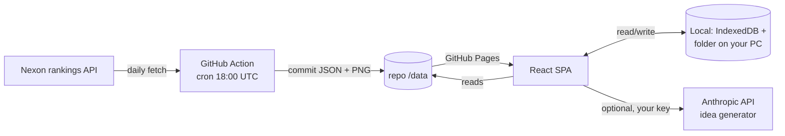
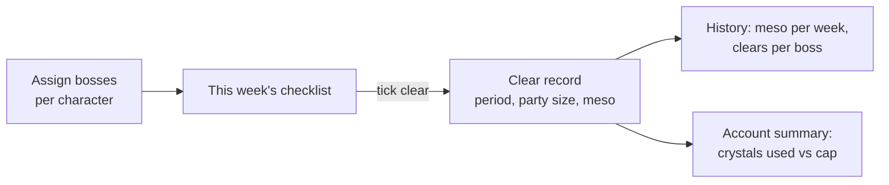
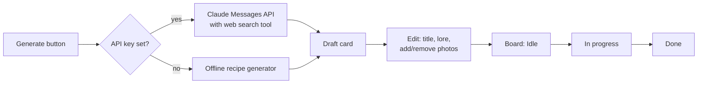

# MapleTracker + Build Board — Design Doc

2026-09-22 · @Someone

## Overview

A private React single-page app on GitHub Pages with two halves: a GMS MapleStory account tracker that fills itself from Nexon's public rankings and adds a hand-kept boss-clear ledger, and a Minecraft build-idea board with an AI generator. There is no server anywhere. History accumulates in two places: a scheduled GitHub Action that commits daily snapshots into the repo, and your own PC through the browser's File System Access API.

Users: you and at most one friend. Region: GMS only. UI is English only. v1 covers automatic data (level, EXP, legion, raid power, character look) plus the boss tracker; other hand-entered stats such as gear, HEXA and symbols are out of scope for now.

## Goals and non-goals

Goals

- Zero hosting cost and zero servers: GitHub Pages + GitHub Actions + the browser.
- Daily EXP, level, legion and look history for every character on the account, collected whether or not the site is open.
- Weekly and monthly boss clears and the meso they earn, per character, with history.
- Data lives somewhere you own and can back up: the repo and a folder on your PC.
- A Minecraft idea board that works offline, with an optional AI generator when you supply an API key.

Non-goals for v1

- Manual stat entry beyond bosses (gear, HEXA, symbols, combat power). Schema leaves room for it later.
- MapleScouter automation. Their terms prohibit it; the hexa score stays a manual field for a later version.
- Public access or accounts. The repo can be public because rankings data is already public; nothing personal is committed.
- Tracking characters below the public-rankings floor (they simply won't appear).
- Localisation. English only.

## Data source: Nexon GMS rankings

The only automatic source for GMS is Nexon's public, no-auth rankings endpoint at `https://www.nexon.com/api/maplestory/no-auth/ranking/v2/na`. There is no official Open API for GMS yet; the KMS/MSEA/TMS Open API keys do not work for GMS. The same endpoint feeds MapleRanks, MapleBot and maplearchive.org.

| Aspect | What we know | Source |
| --- | --- | --- |
| Lookup | `type=overall&id=legendary&character_name=<IGN>` returns the character's row; `type=job`/`type=legion` also exist | community scrapers ([maplestory-level-stats](https://github.com/ebenitez1/maplestory-level-stats)) |
| Page size | 10 entries per page, sorted by exp descending | same |
| Rate limit | No 429; roughly 800 requests in \~5 min from one IP earns a persistent 403 | [maplearchive rankings](https://github.com/maplearchive-org/rankings) |
| Empty pages | Sometimes HTTP 200 with an empty `ranks` array below the block threshold; check `totalCount` | maplestory-level-stats |
| EXP size | Values near 8×10^14 today; past 2^53 `JSON.parse` silently rounds, so parse `exp` as a string | maplearchive rankings |
| Visibility | Only characters in the public rankings appear | both |

Fields per row (from memory of the endpoint, to be confirmed by the first curl in the Risks section): `characterName`, `characterImgURL`, `level`, `exp`, `jobName`, `jobDetail`, `worldName`, `rank`, `legionLevel`, `raidPower`, `gap` (rank change).

Our usage is one request per character per day. With 40 characters that is 40 requests, two orders of magnitude under the block threshold. Character images are hosted on a Nexon CDN and the URL changes with the look, so the image file itself is what we archive.

## Architecture

Three parts, none of them a server: a static SPA served by GitHub Pages, a scheduled GitHub Action that acts as the collector, and the browser on your PC as the store for everything personal.



The Action fetches each character in `characters.json`, writes one snapshot file per day, downloads the character image when its hash changes, and commits. Pages redeploys on push, so the SPA always reads the latest data at a plain relative URL such as `/data/snapshots/2026-09-22.json`. No CORS problem: the fetch happens in the Action (server-side), and the SPA only reads files from its own origin.

The SPA never writes to the repo. Everything you create in the browser (Minecraft ideas, photos, settings, boss clears) is stored locally, with a JSON export so your friend can import your board or you can move PCs.

Why the Action rather than fetching from the browser: a tab that isn't open can't snapshot, and the rankings endpoint most likely doesn't send CORS headers, so a browser fetch would be blocked. The first verification step tests this; if CORS turns out to be allowed, the SPA can also do a live "refresh now" fetch on top of the daily commit.

## Storage without a backend

Yes, the EXP history can live on your PC with no backend. The recommended setup uses two layers: the repo for the automatic snapshots (so they accumulate even when your PC is off) and your PC for everything personal and as a mirror of the snapshots.

| Layer | Where | What it holds | Survives |
| --- | --- | --- | --- |
| Repo data | `/data` in the GitHub repo, committed by the Action | Daily snapshots, character images, character list | Forever; full git history |
| PC folder | A folder you pick once, via the File System Access API | Mirror of snapshots, Minecraft ideas, boss clears, attached photos, settings | Browser reinstalls, cache clears |
| IndexedDB | Browser storage on the same origin | Working copy of everything above, folder handle | Until you clear site data |

How the PC folder works: on first visit you click "Choose data folder" and pick e.g. `D:\MapleTracker`. The browser returns a directory handle; the app stores it in IndexedDB and asks for permission again on the next visit (one click). From then on the app writes `ideas.json`, `settings.json`, `photos/<id>.png` and a `snapshots/` mirror straight into that folder. Chrome and Edge support writable handles; Firefox and Safari do not, so on those browsers the app falls back to IndexedDB plus manual JSON export/import. Everything is JSON and PNG, so the folder is readable without the app and easy to back up.

Merge rule: the repo is the source of truth for snapshots, the PC folder is the source of truth for ideas, boss clears and photos. On load the app reads the repo's `index.json` (list of snapshot dates), fetches any dates missing locally, and writes them to the folder. Nothing is ever uploaded.

Why not skip the Action and store only on the PC: the browser can only fetch when a tab is open, and only if Nexon allows cross-origin requests, which is doubtful. The Action removes both problems for free. If you would rather have nothing in the repo, the same collector script can run as a Windows Task Scheduler job on your PC and write into the same folder; the SPA doesn't care which one produced the files.

Repo visibility: GitHub Pages on a free account requires a public repo. The only data committed is public rankings data (names, levels, EXP, legion, images). Ideas, photos and any API key stay on your PC. If you want the repo private, GitHub Pro (about $4/month) allows Pages from private repos.

## Data model

All files are plain JSON; `exp` is always a string.

`data/characters.json` (you edit this by hand; the Action reads it)

```json
{
  "world": "Kronos",
  "characters": [
    { "name": "YourMain", "role": "main" },
    { "name": "Mule01", "role": "legion" }
  ]
}
```

`data/snapshots/YYYY-MM-DD.json` (one per day, written by the Action)

```json
{
  "date": "2026-09-22",
  "fetchedAt": "2026-09-22T18:02:11Z",
  "rows": [
    {
      "name": "YourMain", "level": 285, "exp": "123456789012345",
      "job": "Night Lord", "world": "Kronos", "rank": 4821,
      "legionLevel": 8500, "raidPower": 1234567,
      "lookHash": "3f9a...", "imgUrl": "https://msavatar1.nexon.net/Character/....png"
    }
  ],
  "missing": ["Mule01"]
}
```

`data/looks/<name>/<lookHash>.png` plus `data/looks/<name>/index.json` listing `{ hash, firstSeen, lastSeen }`. A new entry is added only when the downloaded image's SHA-256 differs from the last one.

`data/index.json` lists every snapshot date so the SPA can fetch without directory listing.

Local-only (PC folder / IndexedDB)

| File | Shape |
| --- | --- |
| `ideas.json` | `[{ id, title, lore, buildType, biome, palette[], sourceLinks[], photoIds[], status, createdAt, updatedAt, generated: bool }]` |
| `photos/<id>.png` | Attached image; `photos.json` maps id → `{ name, addedAt, sourceUrl? }` |
| `bossing/assignments.json` | `[{ character, bossId, difficulty, cadence, defaultPartySize }]` |
| `bossing/clears.json` | `[{ id, character, bossId, difficulty, period, clearedAt, partySize, meso, note? }]` — `period` is the reset-week start date (`2026-09-17`) or the month (`2026-09`) |
| `bossing/prices.json` | Your overrides of the bundled crystal values `{ bossId+difficulty: meso }` |
| `settings.json` | `{ dataFolder: true, apiKeyStored: bool, crystalCap: 14 }` |
| `manual/` | Reserved for later hand-entered stats |

The API key, if you use the generator, is stored in IndexedDB only and never written to the folder or the repo.

## Feature: character tracker

Four screens, all computed client-side from the snapshot files.

| Screen | Shows | Derived from |
| --- | --- | --- |
| Dashboard | Main character card (image, level, % to next level, EXP gained today / 7 days), legion level and raid power, total account levels, a 30-day EXP sparkline, characters that changed look this week | Latest two snapshots + last 30 |
| Character page | Level and EXP line chart over the full history, daily gain bars, 7-day and 30-day average, projected date to next level, rank over time | All snapshots for that name |
| Legion | Roster table: every character with level, job, legion contribution, distance to next tier (60/100/140/200/250) sorted by nearest; legion level and raid power line over time | Latest snapshot + history |
| Fashion timeline | Per character, a horizontal strip of every look with first-seen and last-seen dates; click to enlarge; "looks changed" feed across the account | `data/looks/*` |

Calculations

- Daily gain = `exp(today) − exp(yesterday)` when level is unchanged; on a level-up, gain = `(expToLevel(oldLevel) − exp(yesterday)) + exp(today)`. This needs a static EXP table per level (community table, bundled as `exp-table.json`).
- Projected level date = remaining EXP ÷ 7-day average gain; hidden when the average is 0.
- Legion contribution per character follows the standard tier table; the roster shows contribution rather than raw level so mules at 200 and 250 compare correctly.
- BigInt is used for every EXP operation; charts receive Numbers only after division into billions.

A "Compare" toggle on the dashboard overlays your friend's main on the same chart if they are listed in `characters.json`.

## Feature: boss tracker

Each character gets a list of assigned bosses; each reset period you tick the ones you cleared, and the app records the meso from the crystal, keeps the history, and shows account-wide totals. Nothing here is fetched; it's your ledger, stored in the data folder.



Screens

| Screen | Shows |
| --- | --- |
| Assignments | Per character: pick bosses from `bosses.json`, choose difficulty, cadence (weekly or monthly), default party size. Reorder by drag. |
| Checklist | The current period for every character: one row per assigned boss with a checkbox, party-size stepper, and the meso the clear will pay. Header shows time until reset and crystals used this week against the cap. Bosses from last period that went unticked are highlighted. |
| History | Line chart of meso per reset week over the whole ledger, stacked by character; below it a table of clears for the selected period, newest first. Per-boss streak (consecutive periods cleared). |
| Summary | Expected weekly meso if everything assigned is cleared vs actual for the last 4 weeks; total meso earned since the ledger started. |

Rules

- Weekly bosses reset Thursday 00:00 UTC; monthly bosses reset on the 1st at 00:00 UTC. The period key is the reset-week start date (`2026-09-17`) or the month (`2026-09`), computed in `lib/reset/` in UTC so DST never shifts a period.
- Meso per clear = crystal value ÷ party size, floored. Crystal values come from `bosses.json`, which carries an as-of date; any value can be overridden in Settings and the override is stored in `bossing/prices.json`. When Nexon changes crystal prices you update one file, and old clears keep the meso recorded at the time.
- The weekly crystal cap (GMS: 14 per world) is a setting. The header turns amber at the cap; the app never blocks a tick, since Nexon's cap is on selling, not clearing.
- Unticking a clear deletes its record. Editing party size after ticking recomputes meso for that record only.
- Reset periods with no clears simply don't exist in `clears.json`; the History chart fills them with zero.

`bosses.json` shape, bundled in `public/`:

```json
{
  "asOf": "2026-09-22",
  "bosses": [
    { "id": "lucid", "name": "Lucid", "cadence": "weekly",
      "difficulties": [ { "key": "normal", "crystal": 0 }, { "key": "hard", "crystal": 0 } ] },
    { "id": "black-mage", "name": "Black Mage", "cadence": "monthly",
      "difficulties": [ { "key": "hard", "crystal": 0 }, { "key": "extreme", "crystal": 0 } ] }
  ]
}
```

Crystal values are left at 0 here on purpose; fill them from the current GMS boss crystal table when you build step 5, and record the patch date in `asOf`.

Your friend keeps their own ledger in their own folder. The export zip includes `bossing/`, and import merges by clear `id`, so you can view each other's history side by side without overwriting.

## Feature: Minecraft build ideas

One button produces a build idea with a short lore story, a suggested spot in the world, reference links and photos; the idea lands on a three-column board (Idle / In progress / Done) that you can also fill by hand. The generator has an AI mode that calls the Claude API from the browser with your own key, and an offline mode that needs nothing.



Generated idea (both modes produce the same shape)

| Field | Example |
| --- | --- |
| Title | The Lantern Ferry |
| Build type | Decorative point of interest; farms off by default, a checkbox allows them |
| Placement | "Where a river meets a birch forest, one chunk from spawn" |
| Lore | 3–5 sentences: who built it, why it was abandoned, one hook for a future build |
| Palette | 4–6 blocks (spruce, deepslate tiles, copper, lanterns) |
| Scale | Rough footprint, e.g. 12×18, two storeys |
| Reference links | 2–4 pages found by web search (Planet Minecraft, Reddit r/Minecraftbuilds, GrabCraft) |
| Photos | Hotlinked thumbnails from those pages, kept as URLs; you can remove any and attach your own PNG/JPG files |

AI mode: the SPA sends one Messages API request with the web search tool enabled and a prompt that fixes the output as JSON in the shape above, seeded with constraints you set (biome, size, style, exclude list of ideas already on the board). The browser can call `api.anthropic.com` directly by sending the `anthropic-dangerous-direct-browser-access: true` header; this is Anthropic's supported pattern for bring-your-own-key tools. The key is entered once in Settings and stored in IndexedDB; it never touches the repo or the data folder. Cost is a few cents per idea; see the [Messages API docs](https://platform.claude.com/docs/en/build-with-claude/working-with-messages) for the current model list and web search tool syntax before implementing.

Offline mode: a bundled `recipes.json` of \~40 structure archetypes × \~15 biomes × \~20 lore hooks × palettes, combined randomly with a seed so the same seed reproduces the same idea. No photos are gathered; the card links to a pre-built search URL you can open yourself.

Photos: reference images are stored as URLs only (hotlinked, so the original site keeps ownership and can take them down). Your own attachments are copied into `photos/<id>.png` in the data folder, downscaled to 1600px on the long edge. A card shows up to 6 thumbnails.

Board: cards drag between columns; a card stores `status`, and column order is `updatedAt` newest first. "New idea" opens the same card editor empty. Filter chips for build type, biome and generated vs manual. Export writes `ideas.json` plus the photos folder as a zip so your friend can import into their own board.

Copyright note: build photos found on the web belong to their builders. They're kept as links for personal inspiration, never re-hosted in the repo.

## Tech stack and repo layout

| Concern | Choice | Why |
| --- | --- | --- |
| Framework | React 18 + Vite + TypeScript | Static build, fast dev server, `base` option for the Pages subpath |
| Routing | react-router with hash routes (`/#/legion`) | GitHub Pages has no server rewrites; hash routes never 404 |
| Charts | Recharts | Line and bar charts with little setup |
| Local data | `idb` (IndexedDB wrapper) + File System Access API | Persistent folder handle, fallback to IndexedDB |
| State | Zustand | Small, no boilerplate |
| Styling | Tailwind | Fast, dark-mode by class |
| Collector | Node 20 script in `.github/workflows/snapshot.yml` on `schedule: cron '0 18 * * *'` + `workflow_dispatch` | Runs in the Action, commits with the built-in `GITHUB_TOKEN`; no secrets needed |
| Deploy | `actions/deploy-pages` on push to `main` | Pages picks up both app and `/data` |

```
repo/
  .github/workflows/
    snapshot.yml      # daily collector
    deploy.yml        # build + deploy pages
  scripts/
    snapshot.mjs      # fetch rankings, diff looks, write data/
  data/               # committed by the Action
    characters.json
    index.json
    snapshots/YYYY-MM-DD.json
    looks/<name>/<hash>.png, index.json
  public/
    exp-table.json
    bosses.json       # boss list, difficulties, cadence, crystal values (as-of date)
    recipes.json
  src/
    app/              # routes, top bar
    features/tracker/ # dashboard, character, legion, fashion
    features/bossing/ # assignments, weekly checklist, meso history
    features/ideas/   # generator, board, card editor
    lib/storage/      # fs-access, idb, export/import
    lib/nexon/        # snapshot parsing, BigInt exp math
    lib/reset/        # weekly/monthly reset period math (UTC)
```

The collector script has no dependencies beyond Node's built-in `fetch` and `crypto`, so it also runs unchanged as a local scheduled task if you ever move off Actions.

## Risks, unknowns and first things to verify

The rankings endpoint is undocumented, so the schema above is a best guess until step 1 runs. Do these before writing any UI code.

- [ ] Curl the rankings endpoint for your main and one mule; save the raw JSON and confirm the field names, especially the image URL and legion fields.
- [ ] From a browser console on any GitHub Pages site, `fetch()` the same URL and note whether CORS blocks it. This decides whether a "refresh now" button is possible.
- [ ] Confirm the lowest-level character on the account still appears; if not, note the floor.
- [ ] Run the collector twice on one day and confirm it's idempotent (same file, no duplicate commit).

| Risk | Effect | Mitigation |
| --- | --- | --- |
| Nexon changes or removes the endpoint | History stops | Snapshots are already committed; collector logs a failure and the dashboard shows "last update N days ago" |
| GitHub Actions runner IP shares a block with another scraper | 403 on some days | Retry once after 10 minutes; a missed day leaves a gap, not corruption |
| Image URL is stable even when the look changes | Fashion timeline misses changes | Hash the image bytes, not the URL |
| File System Access API unsupported (Firefox/Safari) | No PC folder | IndexedDB + export/import fallback, shown in Settings |
| GitHub Pages public repo | Anyone can see rankings data for your characters | It's already public on nexon.com; nothing else is committed |
| API key in the browser | Anyone with your PC can read it | It's your own key on your own machine; a spending limit on the Anthropic console caps exposure |
| Hotlinked reference photos disappear | Empty thumbnails on old cards | Card shows the link title; you can attach your own screenshot |

Open question: does the endpoint expose `legionLevel` and `raidPower` per character, or only account totals via `type=legion`? Step 1 answers this and decides the Legion screen's shape.

## Milestones

| Step | Deliverable | Depends on |
| --- | --- | --- |
| 0 | Verification checklist above done; real JSON sample checked into `docs/samples/` | — |
| 1 | Collector script + workflow; first snapshot committed; `characters.json` filled | 0 |
| 2 | SPA skeleton on Pages: top bar, data folder picker, dashboard reading snapshots | 1 |
| 3 | Character page with EXP chart, daily gains, projection | 2, exp table |
| 4 | Legion roster + history; fashion timeline with look archive | 3 |
| 5 | Boss tracker: `bosses.json`, assignments, weekly checklist with reset logic, meso history | 2 |
| 6 | Minecraft board: manual cards, columns, photos, export/import | 2 |
| 7 | Offline idea generator; then AI mode behind an API key in Settings | 6 |
| 8 | Friend onboarding: their characters in `characters.json`, compare toggle, import of their board and clears | 4, 5, 6 |

Steps 3–4, 5 and 6–7 are independent, so the three areas can be built in any order once the skeleton exists.
